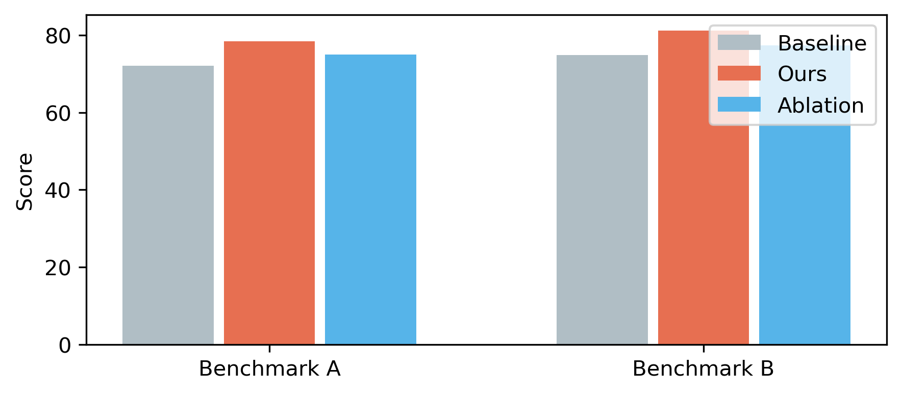
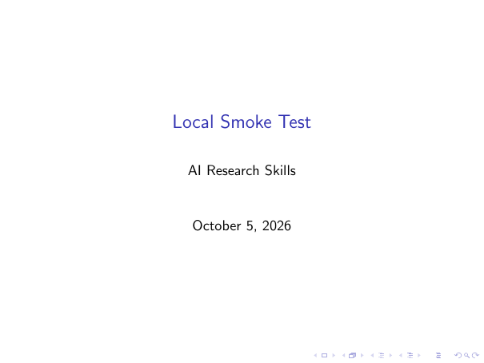
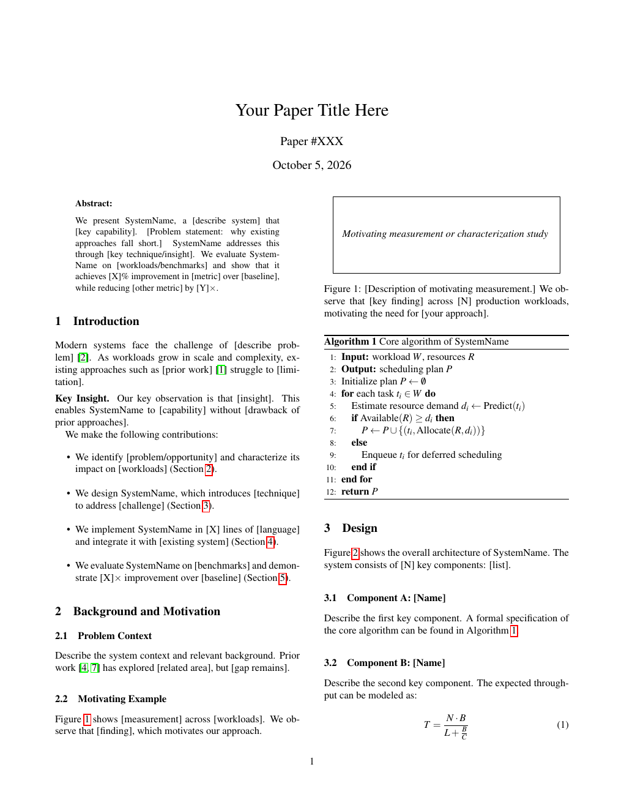

# AI Research Skills

Local, reviewable skills for ML paper writing, academic figures, conference talks, and systems papers.

## Skills

| Skill | Purpose |
| --- | --- |
| [`academic-plotting`](20-ml-paper-writing/academic-plotting/) | Publication-quality charts and technical figures |
| [`ml-paper-writing`](20-ml-paper-writing/ml-paper-writing/) | ML paper structure, templates, and citation guidance |
| [`presenting-conference-talks`](20-ml-paper-writing/presenting-conference-talks/) | Beamer and editable PPTX conference talks |
| [`systems-paper-writing`](20-ml-paper-writing/systems-paper-writing/) | Systems-paper blueprints, checklists, and LaTeX templates |

## Checked outputs

The four skills were statically validated and exercised with local smoke tests. The review web contains the original generated PDFs, PNG, and PPTX:

[`Open the output review page`](skill-output-review/index.html)

### Academic plotting



[PNG](skill-output-review/outputs/academic-plotting/grouped.png) · [PDF](skill-output-review/outputs/academic-plotting/grouped.pdf)

### ML paper writing


[NeurIPS template PDF](skill-output-review/outputs/ml-paper-writing/neurips-template.pdf)

### Presenting conference talks



[Beamer PDF](skill-output-review/outputs/presenting-conference-talks/beamer-slides.pdf) · [Editable PPTX](skill-output-review/outputs/presenting-conference-talks/editable-slides.pptx)

### Systems paper writing



[OSDI template PDF](skill-output-review/outputs/systems-paper-writing/osdi-template.pdf)

## Results and limitations

- Static validation passed for all four skills, including local Markdown-link checks.
- Local chart, LaTeX, Beamer, BibTeX, and PPTX smoke tests passed.
- Gemini image generation and citation API workflows were skipped because they require external APIs or credentials.
- The review web is read-only and uses only local assets.

## Run the review web locally

```powershell
cd skill-output-review
python -m http.server 8765
```

Open <http://127.0.0.1:8765/> in a browser.
